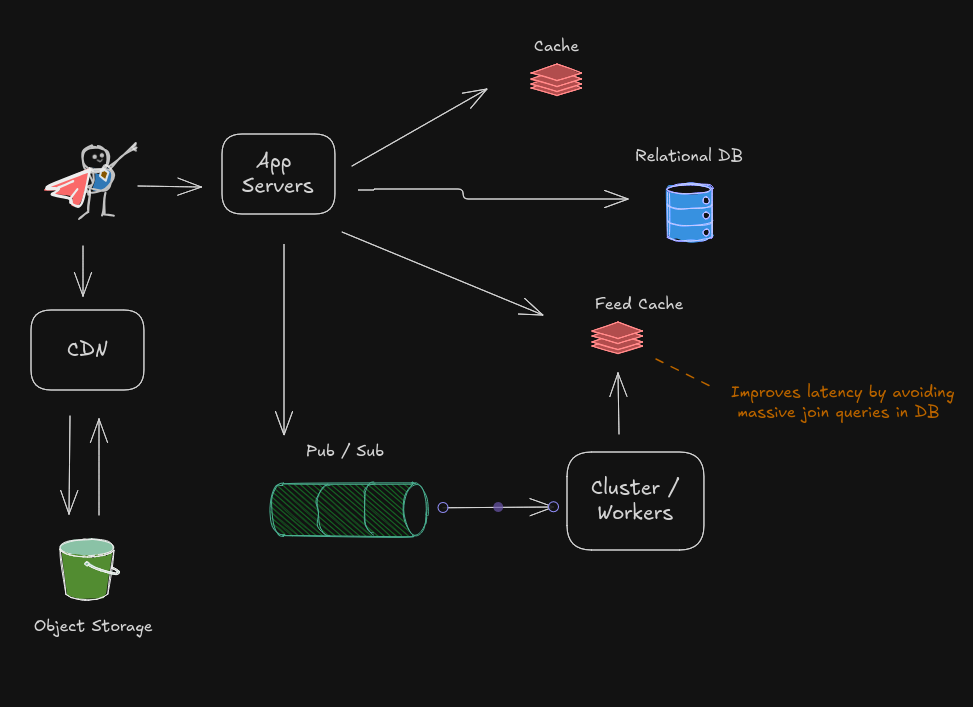

# Designing a Twitter Like Social Network

## 1. Clarify Functional Requirements

Design a twitter like social network where a people can follow and be followed by other people. 

Key concept: read have system!

### What do we want to expend most of our time?

- Follow others
- Create tweets
- View feed -> probabily the most complex. How to rank tweets? See tweets of people we dont  follow? In this case not.

### What are the size of a tweet? Will include images and videos?

- 140 chars
- Yes. It can have images and videos

## 2. Non-Functional Requirements

### How many users are we talking about?

- 500M users with 200M daily active

- 200M active users reading 100 tweets per day. Thats 20B tweets, times 1KB (considering tweet  size + metadata + images/videdos). We can round it to 1MB, but you can always clarify it with the interviewer. 
