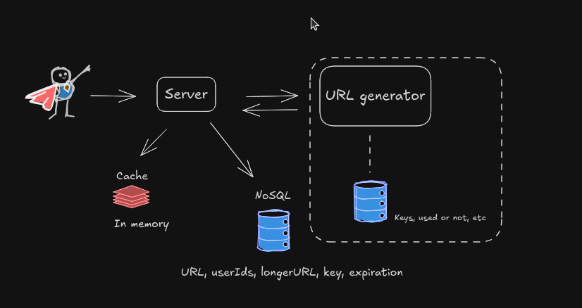
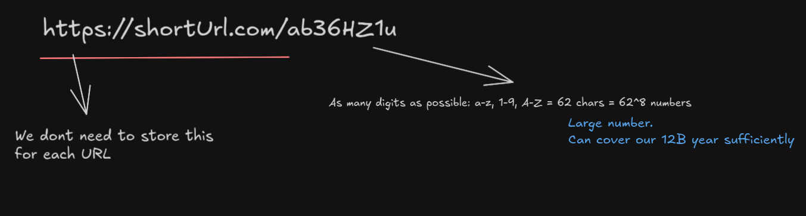

# Designing a URL Shortener

## 1. Clarify Functional Requirements

 The point of a url shortener is to be more user friendly. Some guiding questions: 

### How short is our URL?

8 characters?

### Our URL expiry?

- Consider a year, but users can specify longer times.

### What if different users are trying to short the same long URL? should the shortener
### be the same? different?

- Global (all traffic combined).

- Per endpoint (different rules for different APIs).

- Per client/session.

## 2. Non-Functional Requirements

 As available as possible, as fault tolerance as possible and without considerable additional latency
Important aspects: 

- Scalability

- Will we handle more writes or reads? Reads probabily gonna be a lot more frequently. 
1: 100 ratio. How many short urls are we gonna create per month? 1B/month

How to generate 8 characteres string and make sure that we dont have colisions?
A simple approach: stores keys in a DB and then when a request come just fetch one key from db.
We dont need to generate all 62^8 in a row. We can generate an amount and when starting to running
out of keys we generate more

- Storage
We need huge scale and dont need the ACID rules. 
Some tip of NoSQL to map long url to short url and adittional metadata

- Availability

Aim for high availability (e.g., five nines — 99.999%).

Define fallback behavior:

Fail-open: allow requests if the limiter fails (better uptime).

Fail-closed: block requests if the limiter fails (better abuse protection).

- Latency

Should add minimal overhead (ideally sub-millisecond).

Must not slow down critical API responses.

## 3. Algorithm Choices

- Least frequently used? LRU? Least recently used?
We can prefer to use LRU because probabily a URL will be used a lot when created and then the demand will decreased
